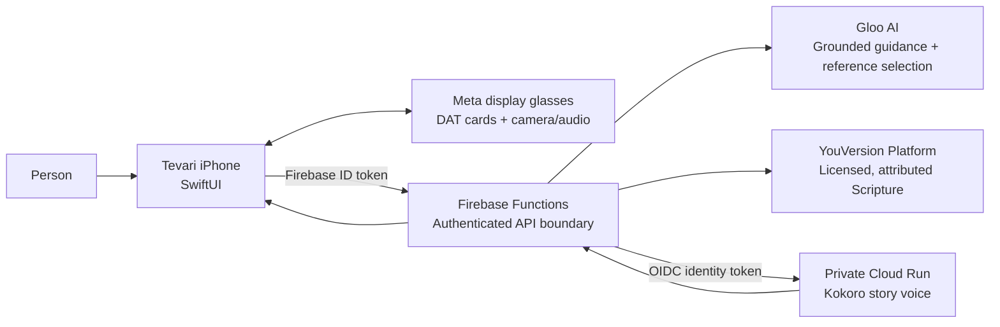

# Tevari

Tevari is an iPhone and Meta display-glasses experience that helps a person meet a real moment with Scripture—through prayer, visual reflection, Bible stories, and **Parallel**, a Scripture-first way to find analogous biblical accounts.

It is built as a product integration, not a Bible-text generator: Gloo provides bounded, tradition-aware AI guidance; YouVersion provides the licensed Bible text shown to the person; and the glasses provide a concise, private-at-a-glance surface for the same experience.

> **Status:** an internal/developer-mode prototype. See [Replication and deployment guide](docs/REPLICATION_AND_DEPLOYMENT.md) for required credentials, cloud resources, Meta configuration, and current distribution constraints.

## What makes Tevari different

- **One faith context across surfaces.** The person selects a faith background—No preference, Evangelical, Catholic, or Protestant—and the selection persists across the phone and glasses experiences.
- **Gloo guides; YouVersion grounds.** AI never presents generated prose as Bible text. Each experience retrieves and attributes a matching NIV11 passage from YouVersion after Gloo chooses the relevant reference.
- **A display-first glasses interaction.** Tevari sends purpose-built, small cards to Meta display glasses: a listening state with live transcription, an explicit send step, a response, and a return path. It does not mirror the iPhone UI.
- **Parallel retrieves scenes, not generic advice.** A person can say “I have been sick for a long time” and receive actual analogous accounts (for example John 5) as scrollable, licensed passages rather than a conversational answer.
- **Narration is intentionally separate.** Gloo creates the short, coherent non-Scripture story narration; a private Cloud Run service synthesizes it with Kokoro and routes playback through the active device/audio route.

## Experiences

| Experience | On iPhone | On Meta display glasses | Gloo + YouVersion role |
| --- | --- | --- | --- |
| Prayer | A focused prayer conversation with an anchored composer | Live `Listening` card, transcript, Send, gentle continuation | Gloo returns one direct prayer continuation and a passage ID; YouVersion returns the displayed Bible text. |
| Faith Lens | Camera/photo picker, prompt, reflection, optional prayer | Explicit camera start, capture, live spoken question, reflection | Gloo analyzes the user-selected image and question; YouVersion supplies the cited passage. |
| Story | Prompt any Bible person/event, read, continue, or hear narration | Prompt → transcript review → scene → narration → More/Scripture | Gloo makes one bounded scene and passage ID; YouVersion provides the canonical passage; Kokoro voices the narration. |
| Parallel | Describe a moment and browse the resulting passage shelf | Voice or camera-supported prompt, then a passage shelf | Gloo is constrained to retrieve 1–3 analogous accounts; YouVersion supplies every displayed passage. |

## Architecture



### Product boundary

The app deliberately keeps the following content separate:

1. **Tevari/Gloo content** — reflections, prayer continuations, scene guides, and narration. These are clearly non-Scripture.
2. **YouVersion content** — Bible text, reference, translation, and attribution. This content is retrieved from YouVersion rather than generated or stored as a local Bible corpus.
3. **Voice audio** — ephemeral WAV returned by the private narration service; it is not a voice clone and requests are not persisted by that service.

## Key implementation details

### Judge’s implementation guide

The table below is the quickest path from a product claim to the source that implements it. All links are repository-relative, so they work on GitHub. The backend is included under [`backend/functions/`](backend/functions/) as a source-only mirror of the deployed Firebase Functions code; it contains no credentials or local environment files.

| What to inspect | Exact source entry point | What it demonstrates |
| --- | --- | --- |
| Authenticated iPhone-to-backend boundary | [`Tevari/TevariAPI.swift`](Tevari/TevariAPI.swift) — `prayerContinuation`, `faithLens`, `storyScene`, `parallel`, `storyNarration` | Firebase ID-token requests and typed response decoding; the phone never holds Gloo/YouVersion secrets. |
| Gloo OAuth and model calls | [`backend/functions/src/index.js`](backend/functions/src/index.js#L64) — `glooAccessToken` and endpoint handlers | Server-side OAuth, Gloo chat-completions requests, tradition handling, bounded structured jobs, and output repair/validation. |
| YouVersion licensed Scripture retrieval | [`backend/functions/src/index.js`](backend/functions/src/index.js#L87) — `licensedScripture` | The selected passage ID is retrieved as NIV11 content with reference/attribution instead of being generated by AI. |
| Faith Lens grounding | [`backend/functions/src/index.js`](backend/functions/src/index.js#L311) — `faithLensDetailsFromRaw`; [`backend/functions/src/index.js`](backend/functions/src/index.js#L465) — `resolveFaithLensPassageID` | Schema repair plus a Scripture-first recovery path that resolves a matching USFM passage when a vision response is incomplete. |
| Prayer, Story, and Parallel orchestration | [`backend/functions/src/index.js`](backend/functions/src/index.js) — `prayerContinue`, `storyScene`, and `parallel` handlers | Separate, constrained prompts for a direct prayer, a Bible story scene, and 1–3 analogous Bible accounts—each grounded through YouVersion. |
| Meta display-glasses experience | [`Tevari/WearablesService.swift`](Tevari/WearablesService.swift) — `startGlassesExperience`, `startPrayerListening`, `startFaithLensCamera`, `startStoryListening`, `startParallelListening` | Meta DAT session lifecycle, explicit camera use, glasses-owned listening/transcript cards, and per-module display flows. |
| Glasses narration and audio routing | [`Tevari/WearablesService.swift`](Tevari/WearablesService.swift#L198) — `prepareGlassesAudioRoute`; [`Tevari/WearablesService.swift`](Tevari/WearablesService.swift#L1695) — narration cards | Route preparation, Tevari-owned narration state, and compact glasses controls rather than a mirrored phone screen. |
| iPhone experience and interaction design | [`Tevari/PhoneExperienceView.swift`](Tevari/PhoneExperienceView.swift) — `PhonePrayerView`, `PhoneFaithLensView`, `PhoneStoryView`, `PhoneParallelView`, `PromptComposer` | The four native phone modules, loading states, anchored composers, photo/camera pickers, narration state, and the phone/glasses switch. |
| Kokoro AI voice service | [`kokoro-story-voice/app/main.py`](kokoro-story-voice/app/main.py); [`kokoro-story-voice/Dockerfile`](kokoro-story-voice/Dockerfile) | Private FastAPI/Cloud Run service, curated Kokoro voice, bounded text chunking, 24 kHz WAV output, and no-store response policy. |
| Private Cloud Run proxy | [`backend/functions/src/index.js`](backend/functions/src/index.js) — `storyNarration`; [`Tevari/TevariAPI.swift`](Tevari/TevariAPI.swift#L173) — `storyNarration(_:)` | Firebase-authenticated, IAM-backed narration proxy: the iPhone and glasses do not call Cloud Run directly. |

For environment setup, deployment order, secret names, Meta configuration, and validation, use the [replication guide](docs/REPLICATION_AND_DEPLOYMENT.md).

### Gloo AI

The Firebase backend obtains an OAuth client-credentials access token from Gloo, then calls `https://platform.ai.gloo.com/ai/v2/chat/completions` with `auto_routing: true`. When the person has selected a faith background, the backend sends Gloo’s named `tradition` parameter (`evangelical`, `catholic`, or `mainline`); Tevari’s internal `general` state intentionally omits it.

Every prompt is scoped to a small structured job. Examples:

- Prayer: a direct prayer continuation plus one USFM passage ID.
- Faith Lens: a short reflection, optional prayer, and one USFM passage ID from a user-selected image plus question.
- Story: a title, guide, 40–60 word spoken narration, and passage ID.
- Parallel: passage IDs only—no explanation or advice—so the user sees Scripture first.

The backend validates, repairs, and bounds model outputs before sending them to the app. Raw model JSON, markdown, and malformed output are never rendered in the product UI.

### YouVersion Platform

The backend retrieves the final Bible content from YouVersion using its server-side app key. Tevari uses Bible ID `111` (**New International Version 2011 / NIV11**) for a consistent, licensed translation. The app shows the returned reference and translation attribution alongside the returned passage. See [`licensedScripture`](backend/functions/src/index.js#L87) and the [`scripturePassage` handler](backend/functions/src/index.js).

### Meta display glasses

`WearablesService` uses Meta’s Device Access Toolkit (DAT) packages:

- `MWDATCore` for registration, device selection, session lifecycle, and callback handling.
- `MWDATDisplay` for the compact card-based glasses UI.
- `MWDATCamera` for explicit, user-started Faith Lens/Parallel captures.

Voice capture is intentionally **not** a generic phone-call-style flow. The implementation clears prior playback/capture state, verifies the audio route, uses speech recognition for live transcription, and updates a Tevari-owned `Listening` display card. Prayer is the reference lifecycle and Story, Faith Lens, and Parallel share the same capture principles.

### AI story voice

`kokoro-story-voice` is a private FastAPI/Cloud Run service built on Apache-2.0 licensed Kokoro-82M. It accepts only Tevari-generated story narration, permits the curated `af_bella` voice, chunks text conservatively for coherent audio, and returns a 24 kHz WAV response marked `private, no-store`.

The iPhone and glasses never invoke Cloud Run directly. `storyNarration` in Firebase Functions verifies the Firebase user, obtains a Google identity token for Cloud Run, validates the WAV response, and returns it to the authenticated app.

## Repository map

```text
Tevari/
├── Tevari/                         # SwiftUI iOS application
│   ├── TevariAPI.swift              # authenticated API client
│   ├── WearablesService.swift       # Meta DAT, audio, camera, glasses cards
│   ├── PhoneExperienceView.swift    # iPhone Prayer / Lens / Story / Parallel
│   ├── TevariAppIntents.swift       # Siri shortcuts for iPhone experiences
│   ├── AuthenticationService.swift  # Firebase / Google / guest auth
│   └── PrivacyInfo.xcprivacy        # iOS privacy manifest
├── kokoro-story-voice/              # private Cloud Run narration service
├── backend/                          # source-only mirror of deployed backend
│   ├── firebase.json                 # Firebase configuration
│   └── functions/
│       └── src/index.js              # Gloo + YouVersion + narration proxy
├── DEVELOPMENT_NOTES.md             # glasses microphone troubleshooting notes
└── docs/
    └── REPLICATION_AND_DEPLOYMENT.md

```

## Local development at a glance

1. Follow the complete [Replication and deployment guide](docs/REPLICATION_AND_DEPLOYMENT.md).
2. Configure Firebase, Gloo, YouVersion, Meta DAT, and the private voice service—never commit their secrets.
3. Open `Tevari.xcodeproj` in Xcode, select a signed physical iPhone, and run the **Tevari** scheme.
4. Use the Phone/Glasses switch inside Tevari. Starting a glasses session is always explicit; Siri only opens private iPhone experiences.

## Security and privacy choices

- Firebase ID tokens authenticate all app-to-backend calls.
- Gloo and YouVersion credentials exist only as Firebase secrets.
- The Cloud Run narration service requires IAM; it is not publicly callable.
- Faith Lens images, prompts, prayer context, and generated narration are processed only for the requested response and are not intentionally persisted by the application services.
- Camera, microphone, speech recognition, Bluetooth, and local-network access are requested only when their user-facing experience needs them.

## Important distribution note

The glasses module currently uses Meta’s iOS Device Access Toolkit in developer-mode integration. Confirm the current Meta program and Apple distribution terms before submitting a build that includes the DAT/ExternalAccessory configuration. The phone experience and backend can be deployed independently; the glasses experience requires approved Meta hardware, registration, and configuration.

## Documentation

- [Replication and deployment guide](docs/REPLICATION_AND_DEPLOYMENT.md) — cloud setup, Gloo/YouVersion secrets, Cloud Run, Firebase, Meta glasses, Xcode, validation, and deployment.
- [Development notes](DEVELOPMENT_NOTES.md) — practical audio/microphone troubleshooting for the glasses experience.
- [Kokoro voice service](kokoro-story-voice/README.md) — narration service contract and deployment boundary.
